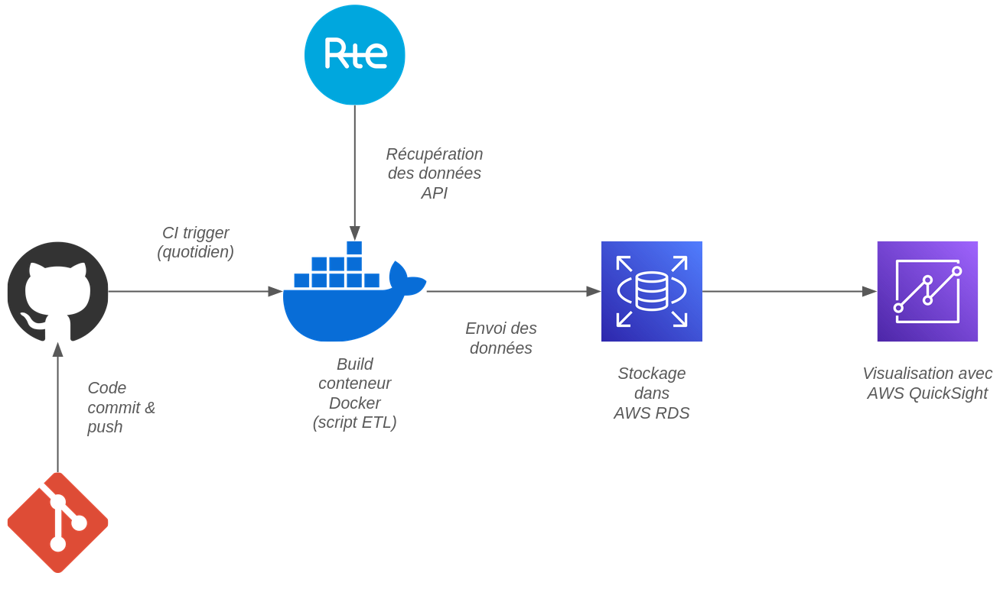
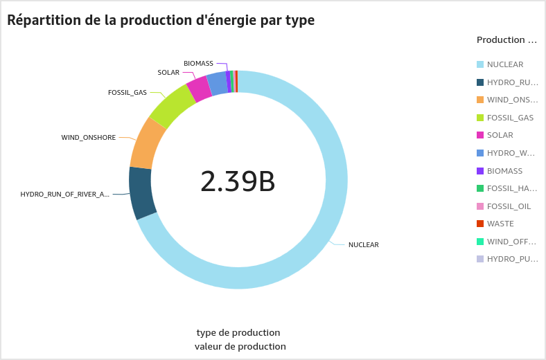
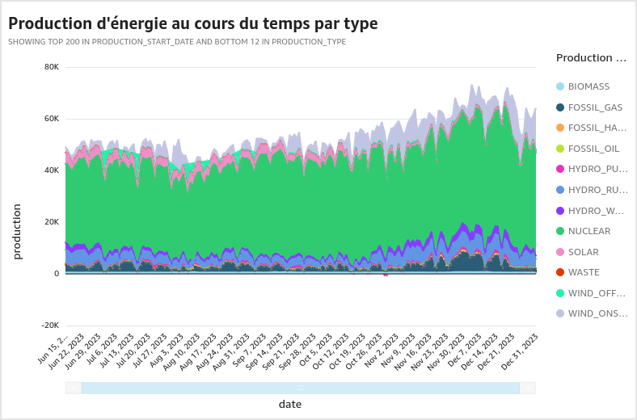
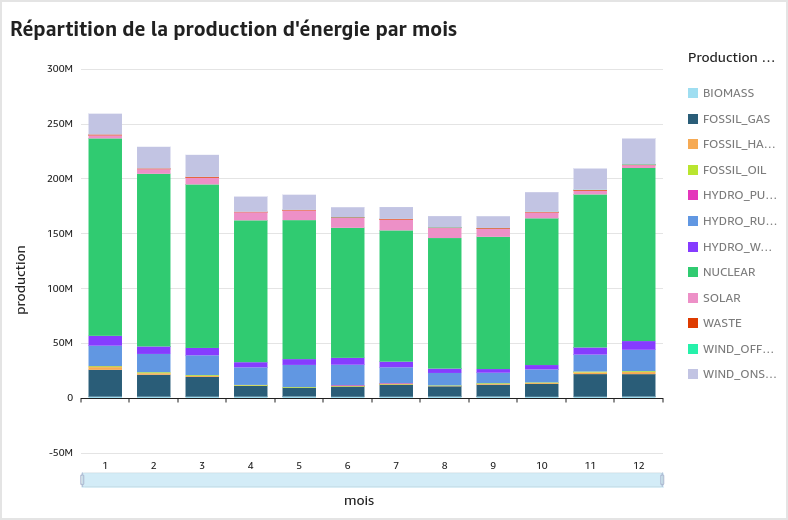
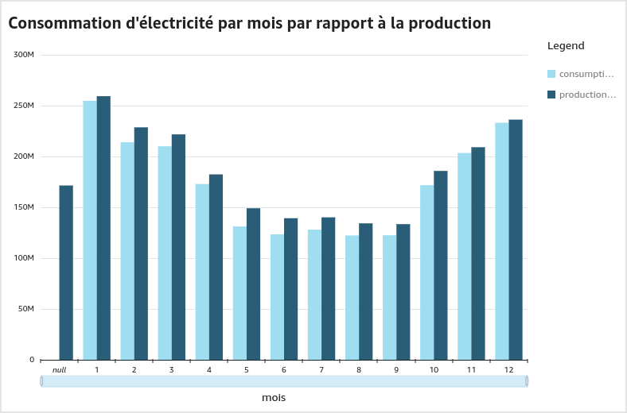
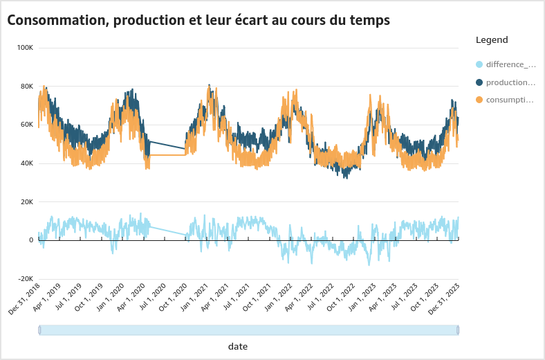
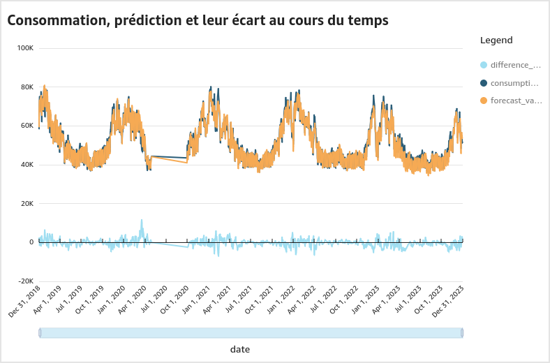
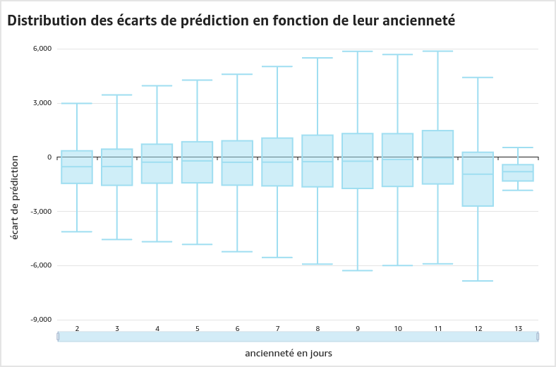
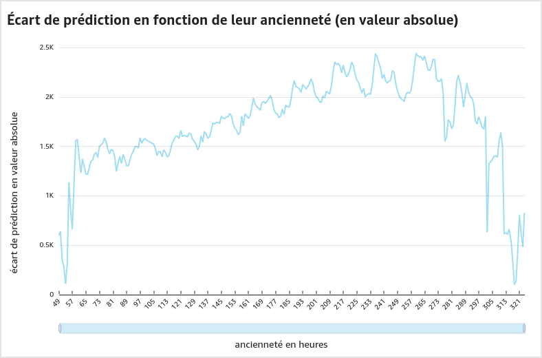

<!-- PROJECT SHIELDS -->

<!-- PROJECT LOGO -->

 

    
    <h3 align="center">RTE Consumption Insights</h3>
    

        Monitoring of France's power consumption and production
    

<!-- ABOUT THE PROJECT -->

## About

This project goal is to provide a cloud-based solution for the retrieving and visualization of daily data regarding France energy generation and consumption.
Using 3 API endpoints from the Réseau de Transport d'Énergie :
- `actual_generation_per_production_type resource`
- `weekly_forecast`
- `consolidated_power_consumption`

we were able to provide meaningful insights on France energy production distribution, consumption forecast and many more.

### Architecture

  

### Insights

#### Power production

  

  

  

#### Power consumption

  

  

#### Forecasting

  

  

  

<a href="#top"><i>back to top</i></a>

## License

Distributed under the Creative Commons Zero v1.0 Universal License. See `LICENSE`for more information.

<a href="#top"><i>back to top</i></a>

<!-- RESOURCES -->

## Resources

RTE. (n.d.-a). Actual Generation. Catalogue API - API data RTE. https://data.rte-france.com/catalog/-/api/generation/Actual-Generation/v1.1

RTE. (n.d.-b). Consolidated Consumption. Catalogue API - API data RTE. https://data.rte-france.com/catalog/-/api/consumption/Consolidated-Consumption/v1.0

RTE. (n.d.-c). Consumption. Catalogue API - API data RTE. https://data.rte-france.com/catalog/-/api/consumption/Consumption/v1.2 

<a href="#top"><i>back to top</i></a>
